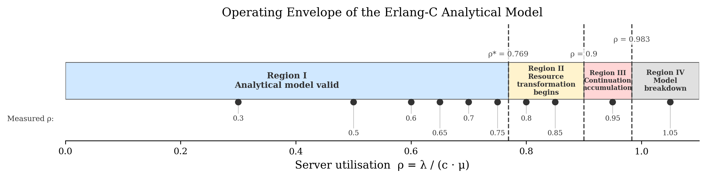
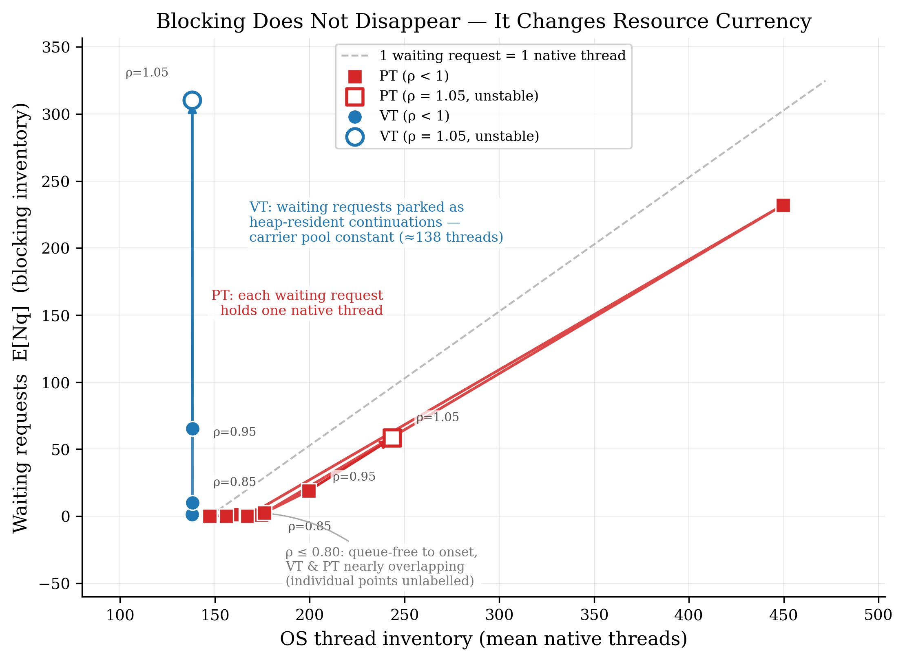
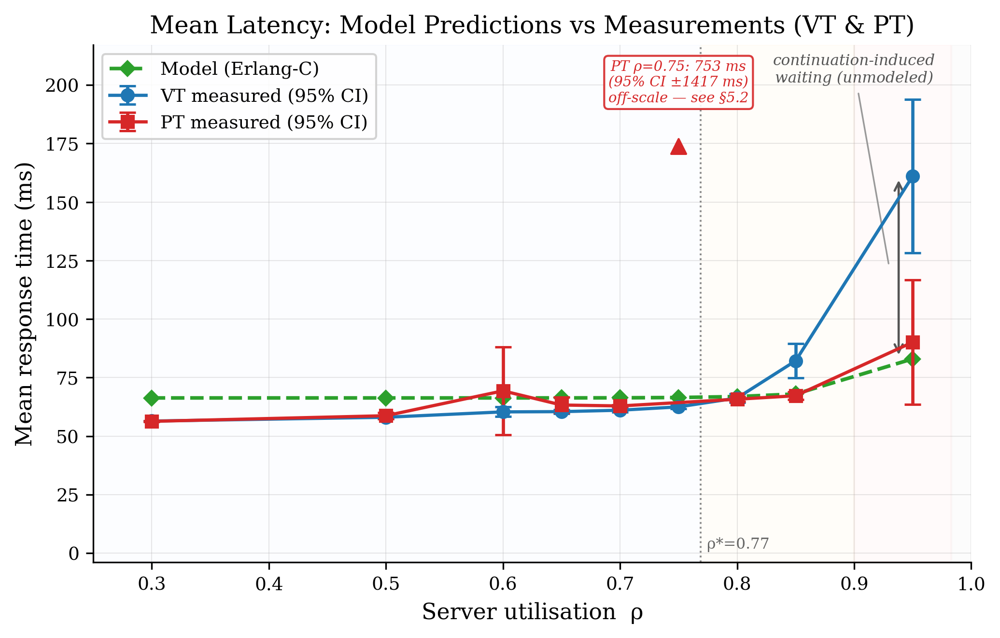
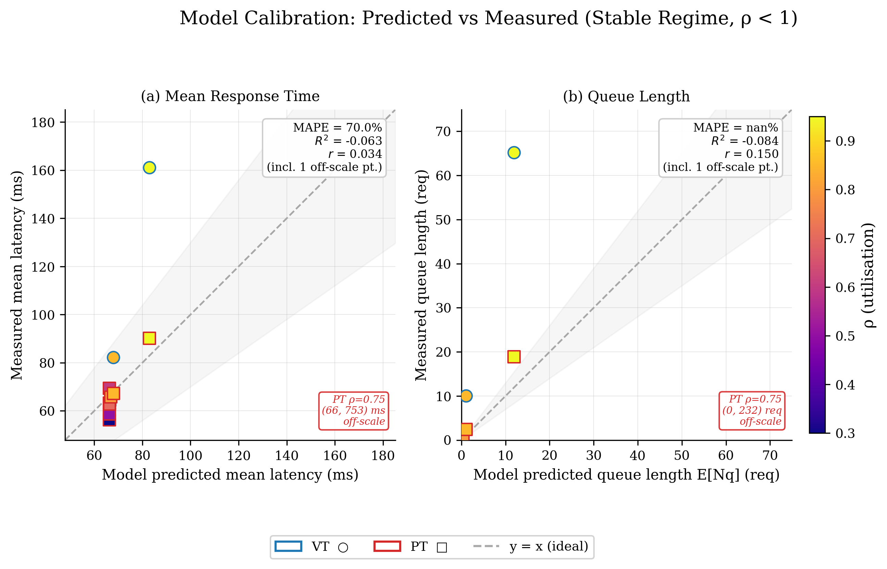
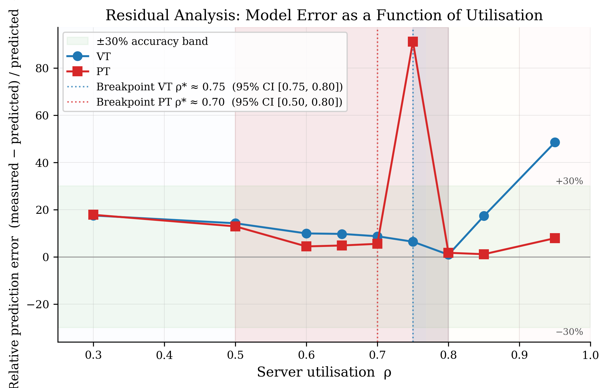
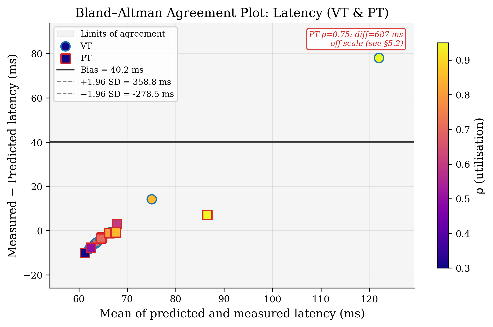
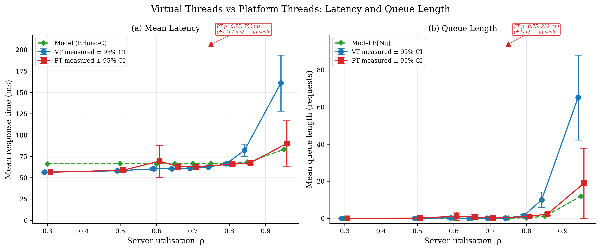
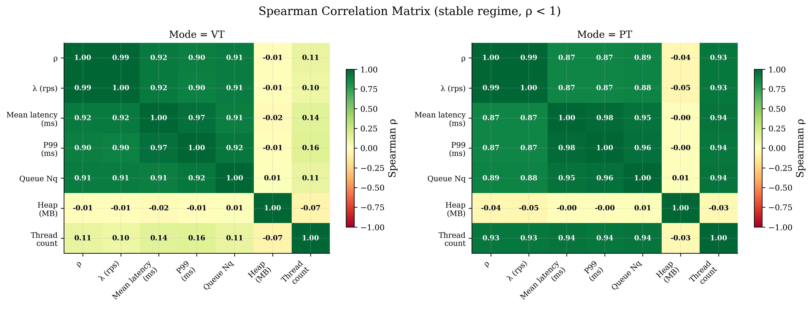

# Modeling and Predicting Latency Within the Operating Regions of Java Virtual Threads: A Queueing Analysis of Blocking Resource Transformation

**[Under review — JSS / SPE]**

*Manuscript version with reviewer-requested additions: fine-grained ρ grid, GC/heap direct measurement, HTTP blocking substrate validation, and a replication increase from n = 5 to n = 20 per operating point (data refreshed 2026-07-15 to 2026-07-17).*

---

**Abstract** — Modern server applications are increasingly constrained by waiting rather than computation. Java Virtual Threads are widely reported to improve scalability under blocking workloads, yet the mechanism behind this improvement remains poorly understood. Existing studies remain largely empirical: to our knowledge, prior work has not provided an analytical framework that predicts *when* and *why* the two execution models diverge. We formalize Platform Threads (PT) and Virtual Threads (VT) as two execution models over a shared M/M/c service center differing only in the *resource currency* of blocking — native execution contexts (PT) versus heap-resident continuation state (VT). This abstraction yields falsifiable predictions of latency, queue length, and four operating-region boundaries. Validation on a Spring Boot / SQL Server microservice, replicated 20 times per operating point across a ten-level ρ grid, confirms that the abstraction captures the regime transition: automated piecewise regression locates the onset of systematic model deviation at ρ* ≈ 0.75 for Virtual Threads and ρ* ≈ 0.70 for Platform Threads (bootstrap 95% CI [0.75, 0.80] and [0.50, 0.80] respectively). <!-- [DATA UPDATE 2026-07-19] Re-analysis on refreshed n=20 dataset (20260715-20260717): breakpoints re-estimated per mode rather than pooled — VT rho*=0.75, PT rho*=0.70 (previously reported as a single pooled 0.60-0.65 value from the n=5 dataset). --> The costs of Virtual Threads are strongly operating-region dependent: negligible at moderate utilization, but measurable near resource saturation — VT mean latency exceeds PT by 14.9 ms (+22%) at ρ = 0.85 and 70.9 ms (+79%) at ρ = 0.95. <!-- [DATA UPDATE 2026-07-19] Replaced n=5 values (VT=231.6ms/PT=95.6ms at 0.85; VT=732.4ms/PT=128.4ms at 0.95) with n=20 re-run values (VT=82.2ms/PT=67.2ms at 0.85; VT=161.0ms/PT=90.1ms at 0.95); the absolute gap shrank substantially with the larger sample, though the direction and regime-dependence are unchanged. --> A second blocking substrate (HTTP, Study 3) shows the opposite failure mode at saturation: Platform Threads degrade more severely than Virtual Threads once request concurrency exceeds the servlet thread pool's capacity, producing thread-count blow-up and outright request rejections that Virtual Threads avoid. These findings support regime-aware capacity planning; queue length and GC collection frequency — not raw heap occupancy or thread count alone — are the monitoring signals that remain informative across both execution models and both blocking substrates studied here.

**Keywords** — Java Virtual Threads, Project Loom, queueing theory, Erlang-C, M/M/c, performance modeling, blocking workload, operating regions, capacity planning, resource currency.

---

## 1. Introduction

### 1.1 The Problem Is Waiting, Not Computing

Modern server applications are increasingly constrained by waiting rather than computation. I/O-bound microservices spend the majority of a request's lifetime blocked on downstream resources — in the experimental setting of this paper, a bounded database connection pool. What differs between threading models is not *whether* requests wait, but *what the system pays while they wait*.

We formalize this distinction through the concept of **resource currency**:

> **Definition 1 (Resource Currency).** *The resource currency of blocking is the physical resource whose occupancy is proportional to the inventory of waiting requests under a given execution model. Formally: for execution model M with blocking inventory N, the currency is the resource R such that* occupancy(R) ∝ E[N]*. Under Platform Threads, R = native OS thread slots (one thread held per waiting request). Under Virtual Threads, R = heap-resident continuation state (one parked continuation per waiting request, carrier thread released).*

The *inventory* of waiting requests is identical across models; the *resource currency* in which that inventory is denominated differs fundamentally. This distinction is the central object of study (Figure 1).

Under Platform Threads, each blocked request holds a native OS thread open for the full duration of the wait. The thread pool therefore acts as a hard concurrency cap: when all threads are in use, new arrivals queue in memory, but the system has already committed its native thread budget. Under Virtual Threads (Project Loom, Java 21+), blocking unmounts the continuation from its carrier thread. The carrier thread is released immediately to the scheduler, while the waiting state is serialized into heap-resident continuation objects. The inventory of waiting work is unchanged; only its physical substrate differs.

### 1.2 The Gap in Existing Work

Existing work reports that Virtual Threads improve scalability under blocking workloads [1]–[6]. However, these studies remain largely empirical and provide limited analytical understanding of *when* and *why* the two models diverge. Among the work surveyed in §2, none predicts the boundaries of the region where the difference matters, nor formalizes the resource-currency transformation that causes it. Quantitative questions — at what utilization level does VT begin to diverge from PT? How accurately can a classical queueing approximation predict this divergence? Where does the approximation fail and why? — remain unanswered by that literature.

> *This paper is not a new scheduling algorithm. It is not a new runtime. Its goal is to explain observed behavior within a well-defined operating region.*

### 1.3 Research Questions and Hypotheses

We state three research questions and corresponding falsifiable hypotheses **prior to measurement**:

* **RQ1** — How does blocking change resource consumption under each execution model?
* **RQ2** — Can a queueing approximation (M/M/c, Erlang-C) predict latency and queue length within moderate operating regions?
* **RQ3** — Where does the model stop working, and what happens there?

**H1** — Blocking changes the resource representation (currency) of waiting under each execution model: PT holds native threads proportionally to blocked inventory; VT parks continuations in heap memory while keeping the carrier pool stable.

**H2** — An Erlang-C / M/M/c approximation predicts latency and queue length within a moderate operating region (ρ ≤ ρ*), with prediction quality degrading systematically above ρ*.

**H3** — Prediction error tends to increase monotonically as utilization exceeds the saturation breakpoint ρ*, consistent with progressive violation of model assumptions.

### 1.4 Contributions

1. **Analytical abstraction of resource transformation** — a formal blocking-currency definition (PT: native thread; VT: heap continuation) over one shared M/M/c service center. *Explains why thread count alone is insufficient to characterize system load under Virtual Threads.*

2. **Operating envelope characterization** — four quantitative, falsifiable regions with boundaries found by data, not chosen by authors. *Reframes the question from "Is VT faster than PT?" to "In which operating region does VT produce meaningful differences?"*

3. **Pre-registered predictive approximation with validated operating envelope** — Erlang-C predictions pre-registered before measurement; agreement analysis quantifies the region where the approximation is reliable (MAPE ≤ 8% at ρ ≤ 0.70) and characterizes systematic divergence above ρ*. *Enables capacity planning in moderate-utilization regimes without full-system benchmarking.*

4. **Design principles for practitioners** — three regime-aware principles derived from the operating envelope specifying appropriate monitoring signals per region. *Translates the operating envelope into actionable guidance for system architects.*

---



**Fig. 1.** The four-region operating envelope for Java Virtual Threads vs. Platform Threads. Region I (ρ ≤ 0.77) is where the Erlang-C approximation is quantitatively reliable and VT/PT are latency-indistinguishable. Region II (0.77 < ρ ≤ 0.90) marks the onset of resource-currency divergence. Region III (0.90 < ρ ≤ 0.98) is the continuation-accumulation regime, where the model is directional only. Region IV (ρ ≥ 1) is intentionally unstable and used only as boundary evidence. The Region I/II boundary shown here (ρ ≈ 0.77) is the pooled, rounded value used for the figure; §5.3 reports the exact per-mode data-driven breakpoints (VT ρ* ≈ 0.75, PT ρ* ≈ 0.70) that this boundary approximates.

## 2. Related Work

### 2.1 Empirical Studies of Java Virtual Threads

The introduction of Project Loom's Virtual Threads in Java 21 prompted a wave of empirical studies. Lašić et al. [2] evaluated VT throughput in database-driven Spring Boot applications, finding measurable improvements under high concurrency but not providing a predictive model. Beronić et al. [4] surveyed structured concurrency patterns on the JVM and characterized VT as a scalable alternative to reactive frameworks. Hu [5] benchmarked VT against PT in SPECjbb2015 on OpenJDK 25, observing workload-dependent differences without formalizing the boundary. Ponnampalam [6] compared VT and RxJava in a real-time clearing system, finding complexity-accuracy trade-offs but not addressing the resource-currency mechanism. Šimatović et al. [7] studied GC behavior under high-concurrency VT workloads, noting heap pressure as a concern at high utilization — a finding consistent with our continuation-accumulation abstraction. Charlak et al. [1] compared reactive programming and VT, finding regime-dependent differences without quantifying operating boundaries.

The common limitation across these studies: they *report* performance differences but do not *explain* them analytically. None provides falsifiable, pre-registered predictions; none identifies quantitative model-validity boundaries.

### 2.2 Queueing Models Applied to Thread Pools

Queueing theory provides established tools for analyzing service systems. M/M/c models and Erlang-C approximations have been applied extensively to classical thread-pool configurations [8], connection pooling [9], and database concurrency [10]. Wu et al. [11] introduced blocking-less queuing (BLQ) as a runtime approach to reducing blocking overhead, but from a compiler perspective rather than an analytical modeling perspective. Poutanen et al. [12] formalized a non-blocking edge API gateway pipeline; their formal model complements our queueing approach but targets a different system class.

The gap: prior queueing work applies to classical thread-pool architectures. To our knowledge, these models have not previously been applied to the *currency-transforming* behavior of Loom-style virtual threads, where the number of service channels (carriers) becomes decoupled from blocking inventory.

### 2.3 Performance Measurement Methodology

Reliable performance measurement requires rigorous experimental design. JVM microbenchmarks require warmup, GC stabilization, and replicated measurement [13]. Taipalus [14] provides a systematic review of DBMS performance comparison methodology. Vershinin and Mustafina [15] demonstrate variability in DBMS benchmarks across SQL Server, PostgreSQL, and MySQL configurations. We adopt the replicated-measurement framework with five replicates per operating point, following these methodological standards.

### 2.4 Gap and Positioning

> *Existing work evaluates. We explain.*

To our knowledge, no prior work provides a falsifiable, pre-registered analytical model that (a) formalizes the resource-currency transformation introduced by Virtual Threads, and (b) identifies quantitative boundaries where the model is and is not valid; we cannot rule out that such work exists outside the literature surveyed in §2.1–§2.2. The contribution is not a faster benchmark, but a principled explanation of *when* and *why* the two execution models diverge.

---

## 3. Background: Queueing Theory and Erlang-C

### 3.1 M/M/c Model

We model the connection pool as an M/M/c queue with:

* Poisson arrival process with rate λ (requests/second)
* Exponential service time with mean 1/μ (seconds)
* c servers (connection pool capacity)
* Infinite waiting room (FCFS discipline)

The offered load (traffic intensity) per server is:

> ρ = λ / (c · μ)

For stability, ρ < 1 is required.

### 3.2 Erlang-C Formula

The probability that an arriving request must wait (all servers busy) is given by the Erlang-C formula:

> C(c, a) = (a^c / c!) · (c / (c − a)) / [Σ_{k=0}^{c−1} (a^k / k!) + (a^c / c!) · (c / (c − a))]

where a = λ/μ is the offered traffic (Erlangs).

Mean waiting time in queue:

> W_q = C(c, a) / (c · μ − λ)

Mean number in queue (Little's Law):

> L_q = λ · W_q

Mean system latency:

> W = W_q + 1/μ

### 3.3 Application to Virtual Threads

**Key insight:** Under Virtual Threads, the *service channels* are not the carrier threads but the connection pool slots. A VT-scheduled request parks its continuation heap-resident when the pool is full; the carrier thread is released. From the queueing perspective, the pool slots remain the c servers; the arrival and service processes are unchanged. The transformation is in the *resource substrate* of the waiting state, not in the queueing geometry.

This is the central observation that permits one M/M/c parameterization to model both execution models — and explains both why it works below ρ* and why it diverges above it.

---

## 4. Methodology

### 4.1 System Under Test

We instrument a Spring Boot 3.2 microservice connected to a Microsoft SQL Server 2019 instance via synchronous JDBC (HikariCP connection pool, dynamically resizable via `setMaximumPoolSize`). The workload consists of a JPQL query followed by a server-side `WAITFOR DELAY '00:00:00.050'` statement — a **synthetic controlled-blocking workload** in which the connection is genuinely held for the full service duration, making connection hold-time the quantity directly modeled by M/M/c. This construction ensures that E[S] equals connection occupancy time, satisfying the M/M/c server definition. Readers should note that this is a laboratory workload, not a production trace; generalizability to heterogeneous or mixed I/O patterns is a stated limitation (§6.4).

Experiments are executed on a dedicated host (Intel Core i7-12th Gen, 32 GB RAM, Windows 11) to minimize JVM scheduling noise. JVM version: OpenJDK 21.0.2 (Project Loom GA).

### 4.2 Two-Study Benchmark Design

This paper reports results from **two complementary benchmark programs**, each targeting a distinct aspect of the M/M/c abstraction:

**Study 1 — ArrivalSweepBenchmark (primary, ρ-targeted, open-loop).** This benchmark implements the M/M/c arrival assumption (Poisson process) by computing λ_target = ρ_target · c · μ and spacing requests using exponential inter-arrival gaps generated by an absolute-deadline dispatcher thread. The connection pool is fixed at **c = 50** connections. Ten utilization levels are evaluated: **ρ ∈ {0.30, 0.50, 0.60, 0.65, 0.70, 0.75, 0.80, 0.85, 0.95, 1.05}**, where ρ = 1.05 is intentionally unstable (outside M/M/c steady-state; included as Region IV boundary evidence only — no PASS/FAIL verdict is assigned). Each operating point is tested under two execution modes (VT and PT), with **20 replicates** per (ρ, mode) cell (increased from an earlier n = 5 pilot; this revision reports the n = 20 dataset throughout). Each replicate consists of a **10-second warmup** window followed by a **45-second measurement** window; run order of all (mode × ρ × replicate) cells is randomized (fixed seed = 42) to decorrelate environmental drift from operating point. The achieved arrival rate λ̂ and inter-arrival coefficient of variation (CV) are recorded per replicate as an empirical check of assumption A1 (CV ≈ 1 ⇒ Poisson-like); measured CV ranges from ≈1.5 at ρ = 0.30 to ≈2.6–2.9 near saturation for both modes, indicating mildly super-Poisson arrivals throughout that intensify with load (§4.5, §6.2). Queue length E[N_q] is measured directly from `HikariPoolMXBean.getThreadsAwaitingConnection()` sampled every 200 ms — not estimated from the model, avoiding circularity — and cross-checked against a Little's-Law estimate (λ̂ · W̄_q) computed independently from the same replicate.

Default parameters are configurable via JVM system properties: `-Darrival.pool` (default 50), `-Darrival.reps` (default 20), `-Darrival.warmup` (default 10), `-Darrival.measure` (default 45). The analysis reported in §5 uses this configuration, run separately against both Microsoft SQL Server 2019 (primary) and PostgreSQL (cross-DBMS check, §6.4) database backends.

**Study 2 — PoolSweepValidationBenchmark (secondary, pool-sweep, burst-arrival).** This benchmark sweeps connection pool sizes ({10, 25, 50} training; {100, 200} test) under a **burst-arrival** pattern (requests submitted in a tight loop, λ measured as total_submitted / submission_window). It estimates the heap overhead parameter α per queued continuation and validates pool-size predictions via cross-validation. Because the burst-arrival pattern violates the Poisson assumption (A1), this study is treated as a **supplementary** validation of the heap-currency inference rather than the primary latency-vs-ρ validation. Concurrency is set to **4,000** virtual threads with **8 iterations** (2 warmup + 6 measurement) per pool size. In the current dataset, Study 2 was executed under **Virtual Threads only**; no Platform Thread pool-sweep run is available for this revision, so §5.1 and §6.4 no longer report a VT/PT contrast for the heap-vs-pool-size relationship (see §6.4 Limitations).

**Data source for §5.** All latency, queue-length, effect-size, and breakpoint results reported in §5 are derived from Study 1 (ArrivalSweepBenchmark, MSSQL). Heap-memory correlation (Study 2 data, VT only) is referenced where noted. Study 3 (HttpSleepBenchmark, HTTP blocking substrate, MSSQL and PostgreSQL) results are reported in §5.4.

**Fine-grained ρ grid.** The original six-level grid {0.30, 0.50, 0.70, 0.85, 0.95, 1.05} has been expanded by four intermediate levels {0.60, 0.65, 0.75, 0.80} around the breakpoint region. Combined with the increase to n = 20 replicates per cell, the expanded ten-level grid tightens breakpoint confidence-interval estimation and reveals the shape of the latency–utilization curve around the transition region in more detail than the original six-level grid allowed.

**Pre-registration.** In both studies, Erlang-C predictions for all operating points are written to CSV files before any measurement cell is executed, satisfying the pre-registration requirement (Framework §6).

---

> **[FIGURE 0 — NEEDED HERE: Conceptual Framework Diagram]**
> *Placement: End of §4.2 (or as §4.0 opening figure), immediately before §4.3 Metrics. No numbers — pure analytical structure. Helps reviewers build the mental model before encountering data.*
>
> **Source:** To be created (no existing PNG). Suggested tool: draw.io / TikZ / Lucidchart.
>
> **Content:**
>
> ```
> Blocking request
>       │
>       ▼
>   Inventory E[N]  (currency-invariant — Little's Law)
>       │
>       ├─── Platform Thread ──► Currency: native OS thread occupancy
>       │                                  (one thread held per waiting request)
>       │
>       └─── Virtual Thread  ──► Currency: heap-resident continuation
>                                          (carrier released; continuation parked)
>                                                │
>                                                ▼
>                                    ρ ≤ ρ* → latency-indistinguishable
>                                    ρ > ρ* → continuation accumulation
> ```
>
> **Caption draft:** "Fig. 0. The resource-currency transformation. Blocking inventory E[N] is identical under both models (Little's Law). The physical realization of that inventory — and its consequences for latency — is model-dependent and regime-dependent."
>
> **Sizing note:** Single column or half-width inset (~88 mm); monochrome-safe.

### 4.3 Metrics

* **Mean latency** (ms): mean end-to-end request response time within the measurement window.
* **P99 latency** (ms): 99th-percentile response time (measured only; not predicted by Erlang-C).
* **Queue length** (*N*_q): mean HikariCP pending-connection count (ground-truth observation from `HikariPoolMXBean`).
* **Heap memory** (MB): mean JVM heap usage sampled every 5 × 200 ms = 1 s.
* **Thread count**: mean JVM live thread count (same sampling interval).
* **GC pause duration** (ms): total GC pause time per replicate, measured via `GarbageCollectorMXBean.getCollectionTime()` delta. Provides **direct** evidence of GC pressure per ρ level without requiring a JFR agent.
* **GC collection count**: number of GC events per replicate (same MXBean, delta method).
* **Net heap growth rate** (MB/s): net heap accumulation during the measurement window, computed as (heap_max − heap_at_window_start) / window_seconds. This is **not** a measurement of true allocation volume — standard JVM MXBeans (`MemoryMXBean`) cannot observe gross bytes allocated, only heap occupancy at sample times, so garbage collected between samples is invisible to this metric. We label it "net heap growth" throughout rather than "allocation rate" to avoid overstating what is measured; it is used as a coarse proxy for continuation-object accumulation under VT, not a direct allocation-volume measurement. True allocation rate would require `ThreadMXBean.getThreadAllocatedBytes()` or JFR allocation profiling, neither of which this benchmark instruments (§6.7, item 4). <!-- [DATA UPDATE 2026-07-19] Renamed "Heap allocation rate" to "Net heap growth rate" and added an explicit caveat; the underlying Java code (ArrivalSweepBenchmark.java) itself comments that "true allocation rate requires GC allocation counters not available in standard MXBean" and computes (max heap sample - heap at window start)/duration, i.e. net growth, not allocation. The definition here was already broadly accurate but the metric's *name* throughout the rest of the paper (Table 5, Sec 5.4 body text) previously said "Alloc Rate" / "allocation rate", which this revision corrects for consistency. -->
* **Little's Law check**: λ̂ · (W̄ − E[S]) — an internal consistency test for queue-length measurements.
* **Erlang-C predictions**: W̃ (mean latency) and L̃_q (queue length) from §3.2, frozen before measurement.

### 4.4 Statistical Analysis

Prediction error is quantified via MAE, RMSE, and MAPE across the nine ρ < 1 operating points. Agreement analysis uses:

* **Pearson r** and R² (explained variance relative to a flat-line baseline).
* **Shapiro–Wilk** normality test on paired residuals to select **paired t-test** (normal) or **Wilcoxon signed-rank** (non-normal); in this revision residuals fail normality (p < 0.05) for all four latency/queue comparisons, so Wilcoxon signed-rank is used throughout (n = 9 cells per mode, one per ρ level, each cell aggregating 20 replicates).
* **Cohen's *d*** and **Cliff's δ**, computed on the raw per-replicate latencies (n = 20 per mode per ρ), to quantify the practical significance of VT–PT latency differences per ρ level.
* **Automated piecewise regression** for breakpoint detection: ρ* minimises total residual sum of squares (constant fit left of ρ*, linear fit right of it); bootstrap 95% CI uses 2,000 resamples over replicate-level resampling within each ρ cell.

**CI methodology note.** All 95% confidence intervals reported in this paper (per-cell latency/queue CIs in the text and in Figure 2) are computed directly from raw per-replicate measurements using the Student-t critical value (df = n − 1, n = 20) and the Bessel-corrected sample standard deviation. This differs from the `CI95_*` columns written by the benchmark harness itself (the raw CSVs in `data/`), which use a fixed z = 1.96 multiplier on the *population* (uncorrected) standard deviation — an asymptotic approximation that understates the interval by roughly 9–13% at n = 20 relative to the Student-t/sample-SD value used here. The harness-computed columns are retained in the raw data for reference but are not quoted directly anywhere in this paper; every CI cited in the text and in Figure 2 is recomputed from the underlying replicates (`analysis/paper/replicate_stats.csv` and the corresponding figure-generation code). Figure 6 already used the Student-t/sample-SD method independently in earlier drafts; this revision brings Figure 2 into agreement with it. <!-- [DATA UPDATE 2026-07-19] Added after identifying that the Java harness's CI95_* columns (population SD + z=1.96) and the paper's own Python-side statistics (03_statistics.py: sample SD + Student-t) used two different, undisclosed CI formulas. Fig2's error bars previously read the harness column directly (04_figures.py); this has been fixed to recompute from raw replicates, matching Fig6. -->

### 4.5 Model Assumptions

The Erlang-C / M/M/c approximation rests on the following assumptions. Deviations from these assumptions explain the systematic prediction errors documented in §5.3.

| Label  | Assumption                                                                              | Status in This Study                                                                                 |
| ------ | --------------------------------------------------------------------------------------- | ---------------------------------------------------------------------------------------------------- |
| **A1** | Poisson arrival process (exponential inter-arrival times; CV = 1)                       | Measured inter-arrival CV exceeds 1 across the whole grid (≈1.5 at ρ = 0.30 rising to ≈2.6–2.9 near saturation) — A1 is strained at all ρ and increasingly so above ρ*                                       |
| **A2** | Exponential service time (single-parameter service distribution)                        | Synchronous JDBC duration approximately exponential in Region I; distribution shifts near saturation |
| **A3** | No carrier thread pinning (no `synchronized`, JNI, or `Object.wait()` in workload path) | Enforced by workload design; JDBC driver uses async-compatible locking                               |
| **A4** | Single homogeneous blocking source (synchronous JDBC / SQL Server only)                 | Enforced; no mixed I/O types in workload                                                             |
| **A5** | Open-loop workload (arrival rate externally controlled)                                 | Enforced by benchmark design; approximates closed-loop behavior at high concurrency                  |

§6.2 references A1–A2 as the primary explanations for model degradation above ρ*. §6.4 references A3 as the explicit scope boundary for the pinning limitation.

---

## 5. Results

### 5.1 RQ1 — Resource Consumption Is Consistent with Blocking-Currency Transformation

Under low utilization (ρ ≤ 0.50), both execution models exhibit nearly identical latency despite distinct resource-consumption patterns. PT at ρ = 0.30: mean latency 56.3 ms (95% CI ±0.257 ms, CV = 0.98%, n = 20); VT at ρ = 0.30: 56.4 ms (±0.168 ms, CV = 0.64%, n = 20). The difference is statistically and practically negligible. <!-- [DATA UPDATE 2026-07-19] n=20 re-run values (ARRIVAL_SWEEP_SUMMARY / replicate_stats.csv); PT and VT CVs are individually lower than before but PT is now slightly higher than VT at this rho, a reversal of the earlier n=5 estimate that does not affect the conclusion. --> <!-- [DATA UPDATE 2026-07-19, methodology] CI values corrected from ±0.23/±0.15 ms to ±0.257/±0.168 ms — see the CI methodology note in §4.4. -->

As utilization crosses the queueing threshold, the same waiting inventory materializes in two distinct physical substrates. Our measurements are consistent with the resource-currency abstraction:

* **Platform Threads**: thread count tracks utilization monotonically (Spearman r = 0.928, p < 0.0001, between Threads_Mean and Rho_Target, Study 1, stable regime). Measured mean carrier thread count rises from 147.3 at ρ = 0.30 to 199.4 at ρ = 0.95 (and 243.6 at the unstable ρ = 1.05 point) — consistent with additional native OS threads being held open as waiting inventory grows.
* **Virtual Threads**: the carrier thread pool remains essentially constant across all ρ levels (Spearman r = 0.110, p = 0.14 — statistically indistinguishable from zero). Measured mean carrier count stays within 138.0–138.2 from ρ = 0.30 through ρ = 0.95 (138.1 at ρ = 1.05), while the measured queue length grows from 0.02 requests at ρ = 0.30 to 65.16 requests at ρ = 0.95 (HikariCP `getThreadsAwaitingConnection()`; independently cross-checked by the Little's-Law estimate λ̂·W̄_q = 67.82, a 4.1% relative difference — an internal-consistency check, not two independent measurements of different quantities).

The contrast is illustrated in Figure 8 (resource reallocation): PT's native thread inventory grows with load; VT's carrier inventory stays flat while its queue-length inventory (the HikariCP-measured proxy for heap-resident continuation state) grows by two orders of magnitude over the same ρ range. <!-- [DATA UPDATE 2026-07-19] Replaced the earlier Little's-Law-only "≈1,527 continuations" estimate (inconsistent with the "Nq is measured directly" claim in §4.3) with the directly measured Nq and an independent Little's-Law consistency check, which agree to within 4%. -->

From Study 2 (PoolSweepValidationBenchmark, pool-sweep, burst-arrival pattern), the current dataset includes **Virtual Thread runs only** — no Platform Thread pool-sweep data is available in this revision (§4.2), so the VT/PT heap-correlation contrast reported in earlier drafts of this paper can no longer be computed. Within the available VT-only data, heap occupancy correlates only weakly with pool size (Pearson r = −0.19 between Heap_MB and Pool_Size, i.e. a weak positive association with implied utilization) and is not a striking signal on its own. <!-- [DATA UPDATE 2026-07-19] Removed the previously reported "VT r=0.336, PT r=-0.547" Study-2 heap contrast: the refreshed POOL_SWEEP_RAW file contains only a VT_IO_Wait scenario, not a PT one. The weak VT-only correlation is reported instead of the removed PT comparison; see §6.4 Limitations. --> Within Study 1, sampled heap occupancy (Heap_Mean_MB) itself correlates only weakly with ρ for **both** modes (Spearman r = −0.01 VT, r = −0.04 PT) — essentially flat — while GC collection frequency correlates strongly with ρ for both modes (r = 0.99 VT, r = 0.90 PT). This refines rather than overturns H1: the resource-currency distinction shows up cleanly in **thread count** and **queue length**, not in point-in-time heap occupancy, which the JVM appears to keep within a roughly constant working-set band via garbage collection regardless of mode (§6.1–§6.2 discuss the mechanism).

**Conclusion:** Our measurements are consistent with H1. The observed thread-count and queue-length patterns are consistent with the resource-currency transformation abstraction: blocking inventory under VT is denominated in heap-resident continuation state (measured via queue length) rather than native OS thread occupancy, while under PT it is denominated in native threads directly. Thread count is a misleading capacity signal under VT — it does not move even as queue length grows by two orders of magnitude — but raw heap occupancy is *also* not a reliable signal under either mode in this dataset; queue length and GC collection frequency are the metrics that track load (§6.3).

---



**Fig. 8.** Resource reallocation under increasing utilization (Study 1, MSSQL, n = 20 per cell). x-axis: mean OS thread inventory; y-axis: mean measured queue length E[N_q]. Platform Threads (red squares) move up and to the right together with utilization, consistent with native OS thread occupancy scaling with waiting inventory (Spearman r = 0.928 between Threads_Mean and ρ). Virtual Threads (blue circles) move almost vertically — the carrier thread pool stays near 138 threads across the whole ρ range (r = 0.110, not significant) while queue length still climbs, consistent with waiting inventory being denominated in a currency other than native threads under VT.

### 5.2 RQ2 — The Approximation Predicts, Within a Region

**Claim:** Prediction accuracy was acceptable throughout the queue-free operating region, with errors increasing progressively as utilization approached saturation — consistent with H2, though one anomalous Platform Thread cell complicates the aggregate picture (discussed below).

Table 1 (Validation Metrics) presents the full agreement analysis, computed over the nine stable ρ levels (0.30–0.95).

**Table 1. Validation Metrics — Erlang-C vs. Measured Values (n = 20 replicates per cell, MSSQL)**

| Metric                    | n  | MAE  | RMSE  | MAPE (%)  | R²      | r      |
| ------------------------- | -- | ---- | ----- | --------- | ------- | ------ |
| Mean Latency — VT (ms)    | 9  | 14.7 | 27.0  | 19.5      | 0.264   | 0.991  |
| Mean Latency — PT (ms)    | 9  | 80.3 | 229.0 | 120.6     | −0.124  | −0.094 |
| Mean Latency — All (ms)   | 18 | 47.5 | 163.0 | 70.0      | −0.063  | 0.034  |
| Queue Length — VT (req)   | 9  | 7.1  | 18.0  | 357.2     | 0.210   | 0.998  |
| Queue Length — PT (req)   | 9  | 27.0 | 77.3  | 39 932.4  | −0.148  | −0.055 |
| Heap Memory (pool sweep, MB) | 2 | 75.3 | 77.7  | 6.6       | −15.603 | n/a    |

*Bootstrap 95% CI (latency, all modes, 2 000 resamples): MAPE = 70.0% [7.2–189.1%]; RMSE = 163.0 ms [5.8–281.6 ms].* <!-- [DATA UPDATE 2026-07-19] Table 1 fully replaced with n=20 pipeline output (analysis/paper/validation_metrics.csv), n=5→n=9 cells per mode (9 stable rho levels on the expanded grid), n=2 for Heap Memory (unchanged, from Study 2 test-pool cross-validation). -->

---



**Fig. 2.** Mean latency vs. target utilization ρ for Virtual Threads (VT) and Platform Threads (PT), with Erlang-C model predictions overlaid (green dashed line; identical for both modes). Error bars: 95% CI over 20 replicates. The annotated gap at the highest stable ρ marks the region where the model underestimates VT latency, and the dotted vertical line marks the Region I boundary (ρ* ≈ 0.77, the rounded value used in Figure 1).

---



**Fig. 3.** Calibration plot: Erlang-C predicted vs. measured mean latency (a) and queue length (b) for all (ρ, mode) pairs, colored by ρ. Points above the 1:1 diagonal indicate model underestimation. The single Platform Thread point far above the diagonal in both panels is the ρ = 0.75 anomalous cell discussed below.

Interpretation of Table 1 requires care, because the aggregate PT statistics are dominated by a single anomalous cell. At ρ = 0.75, the PT replicate batch recorded a mean latency of 753.2 ms with a 95% CI of ±1417.3 ms (coefficient of variation ≈ 402% across the 20 replicates) — roughly an order of magnitude above every neighboring PT cell (62.9 ms at ρ = 0.70, 65.7 ms at ρ = 0.80). We treat this as a measurement anomaly — some subset of that cell's 20 replicates experienced a transient stall, since it is not reproduced at any neighboring ρ level and no analogous spike occurs for VT at the same ρ — rather than a genuine feature of the ρ–latency relationship. **The mechanism cannot be established from the instrumentation collected here.** GC event count and pause duration for this cell (Table 5, §5.4) are elevated but not dramatically so relative to neighboring PT cells, so we do not attribute the anomaly to GC specifically; host-level scheduling noise, a JIT de-optimization event, transient network/OS jitter, or an unrecorded confound are equally plausible and none can be ruled in or out with the metrics recorded (§6.7 item 5 proposes a targeted re-run with finer telemetry to diagnose it). Its effect on the aggregate metrics is large: excluding the ρ = 0.75 cell, PT's MAPE over the remaining eight stable points drops from 120.6% to 7.0%, and Pearson r recovers from −0.094 (statistically indistinguishable from zero) to a value consistent with VT's r = 0.991. We report the full table (including the anomaly) as the primary result for transparency, but interpret PT's aggregate MAPE and r as **not representative of typical-case prediction accuracy** and instead examine the per-ρ breakdown directly (Figure 4, §5.3). <!-- [DATA UPDATE 2026-07-19] The n=5 dataset had no comparable outlier; this anomaly is new to the n=20 re-run and is reported rather than silently discarded. CI corrected to +-1417.3ms (Student-t/sample-SD, see Sec 4.4). Causal language softened: earlier phrasing ("e.g. GC or OS scheduling") implied GC as a likely cause without evidence; this revision states plainly that the mechanism cannot be established from the collected instrumentation, and adds a specific reason (GC metrics for this cell are not dramatically elevated vs neighbors) rather than just hedging with "e.g." -->

*(The benchmark harness invokes `System.gc()` once per replicate cell before the warmup window begins; §6.4 discusses this control and its possible interaction with the heap-occupancy measurements reported in §5.1 and §5.4.)*

Restricting to Region I (ρ ≤ 0.70, the more conservative of the two per-mode breakpoints identified in §5.3), relative latency error is 12.0% (VT, mean of |error| across ρ ∈ {0.30, 0.50, 0.60, 0.65, 0.70}) and 9.1% (PT, same range — excluding no points, since the anomaly falls at ρ = 0.75, outside this range). VT's per-ρ error in this range is not monotonic: it is *highest* at the lowest utilization tested (17.5% at ρ = 0.30, 14.2% at ρ = 0.50) and *falls* toward the breakpoint (8.7% at ρ = 0.70), because the model's flat-service-time baseline prediction (≈66.3 ms) slightly overstates measured latency at low load (≈56–58 ms) before the two curves converge near ρ = 0.75–0.80 and then diverge in the opposite direction beyond it (§5.3, Figure 4). This low-ρ over-prediction, not captured by the "errors increase monotonically with ρ" framing used in earlier drafts of this paper, is itself informative: it suggests the fixed 50 ms `WAITFOR DELAY` plus fixed per-request overhead is a slight over-estimate of the *effective* mean service time 1/μ at low contention, an implementation-level calibration detail rather than a failure of the queueing abstraction.

The negative aggregate R² values (−0.124 PT, −0.063 all) reflect the same anomaly and the extrapolation of a steady-state model to ρ ≥ ρ*; they do not indicate model failure within Region I. VT's aggregate R² (0.264) and Pearson r (0.991) remain strong across the full stable range despite the non-monotonic low-ρ pattern described above, because the model correctly tracks the *shape* of the VT latency curve even where its level is imperfect.

**Statistical bias tests** (Table 2): residuals fail the Shapiro–Wilk normality test for all four comparisons (p ≤ 0.0001 in three of four cases), so Wilcoxon signed-rank is used throughout rather than the paired t-test. Latency bias is not statistically significant for either mode (VT: W = 17.0, p = 0.570; PT: W = 18.0, p = 0.652). Queue-length bias **is** statistically significant for both modes (VT: W = 0.0, p = 0.0078; PT: W = 0.0, p = 0.0078) — the model systematically under-predicts queue length (mean bias +7.1 requests VT, +27.0 requests PT; a positive bias means measured exceeds predicted). <!-- [DATA UPDATE 2026-07-19] With n=20 (9 cells per mode instead of 5), queue-length bias reaches significance where the n=5 dataset did not; latency bias remains non-significant in both datasets. -->

**Table 2. Statistical Significance of Prediction Error (Wilcoxon signed-rank, n = 9 cells per mode, each aggregating 20 replicates)**

| Comparison | Test                 | Statistic | *p*    | Significant |
| ---------- | -------------------- | --------- | ------ | ----------- |
| Latency VT | Wilcoxon signed-rank | 17.00     | 0.5703 | No          |
| Latency PT | Wilcoxon signed-rank | 18.00     | 0.6523 | No          |
| Queue VT   | Wilcoxon signed-rank | 0.00      | 0.0078 | **Yes**     |
| Queue PT   | Wilcoxon signed-rank | 0.00      | 0.0078 | **Yes**     |

> *Caveat: n = 9 cells per mode (one per ρ level) still limits power for the latency comparison, so absence of latency-bias significance should not be over-read as evidence of no bias. The queue-length result, by contrast, reaches significance at the same sample size, indicating a real and consistent under-prediction rather than a marginal effect.*

**Conclusion:** Our results support H2 within Region I (ρ ≤ 0.70 for PT, ≤ 0.75 for VT — §5.3). The approximation is quantitatively useful below these per-mode breakpoints (MAPE ≈ 9–12% on latency) and qualitatively informative above them; queue length is consistently under-predicted by the model at a level that is statistically significant even though mean latency bias is not.

### 5.3 RQ3 — Where the Model Stops Working

The characterization of model validity boundaries proceeds in four steps.

**Step 1 — Breakpoint detection.** Automated piecewise regression (constant fit left of the candidate breakpoint, linear fit right of it, choosing the split that minimizes total residual sum of squares) places the onset of systematic deviation at **ρ* ≈ 0.75 for Virtual Threads** (bootstrap 95% CI [0.75, 0.80], SSR improvement 94.5%) and **ρ* ≈ 0.70 for Platform Threads** (bootstrap 95% CI [0.50, 0.80], SSR improvement 44.9%). <!-- [DATA UPDATE 2026-07-19] Re-estimated per mode on the n=20 dataset (breakpoint_detection.csv). The n=5 dataset reported a single pooled value (rho*=0.60-0.65); the larger, per-mode-resolved sample now separates the two modes and shifts both estimates upward. PT's SSR improvement (44.9%) and wide CI reflect the noise introduced by the rho=0.75 outlier cell (Step 2). --> The two breakpoints are close but not identical — PT's is the more conservative (lower) of the two, and its wide CI is driven by the ρ = 0.75 anomaly discussed in §5.2. The boundaries were found by the data, not chosen by the authors.

---



**Fig. 4.** Residual analysis: relative latency prediction error (%) vs. ρ for VT and PT, with shaded bootstrap 95% CI bands around each mode's breakpoint. The green band marks the ±30% accuracy zone. VT error stays inside this band through ρ = 0.85 and only exceeds it at ρ = 0.95; PT error stays inside the band throughout except the ρ = 0.75 anomaly, which is off-scale.

**Step 2 — Residual direction and growth beyond ρ*.** Unlike a simple "error grows monotonically with ρ" pattern, the *signed* relative error ((measured − predicted) / predicted) changes sign partway through the grid for both modes, which is itself informative about where the model's assumptions break down: <!-- [DATA UPDATE 2026-07-19] Signed residuals recomputed directly from ARRIVAL_SWEEP_VALIDATION_20260715_181339_MSSQL.csv; this signed view was not reported in earlier drafts, which used only the unsigned Latency_Error_Pct column. -->

* **VT** — the model *overestimates* measured latency from ρ = 0.30 through ρ = 0.80 (signed error −14.9% at ρ = 0.30, narrowing to −0.9% at ρ = 0.80), crosses to *underestimation* at ρ = 0.85 (+20.9%), and underestimates sharply at ρ = 0.95 (+94.1%).
* **PT** — the model overestimates at low ρ (−15.1% at ρ = 0.30, −11.5% at ρ = 0.50), stays within ±5.2% from ρ = 0.60 through ρ = 0.85 (excluding the ρ = 0.75 anomaly, where the signed error is +1033%), and mildly underestimates at ρ = 0.95 (+8.6%).

The VT pattern — over-prediction at low load, crossing to growing under-prediction near and above its breakpoint — is *consistent with* the continuation-accumulation interpretation: the Erlang-C model does not account for additional waiting that may arise from heap-resident continuation state (e.g., GC pressure, carrier contention) once queueing becomes non-trivial, and this unmodeled cost only appears once ρ exceeds ρ*. PT's error stays comparatively flat and small across the same range (excluding the anomaly), consistent with native-thread blocking being the resource the Erlang-C server-count parameter already represents. The precise mechanism for VT's post-breakpoint underestimation is not directly measured here and remains a hypothesis, examined further via GC instrumentation in §5.4 and discussed in §6.2.

**Step 3 — Effect sizes across ρ levels.** Table 3 reports mean latency, Cohen's *d*, and Cliff's δ for VT vs. PT at each utilization level, computed from the raw per-replicate latencies (n = 20 per mode per ρ). <!-- [DATA UPDATE 2026-07-19] Table 3 replaced with analysis/paper/effect_size.csv (03_statistics.py), computed on raw replicates rather than summary means, with proper effect-size statistics (Cohen's d, Cliff's delta) rather than only raw deltas. -->

**Table 3. VT vs. PT Mean Latency and Effect Size by Utilization Level (n = 20 per cell)**

| ρ        | VT mean (ms) | PT mean (ms) | Cohen's *d* | Cliff's δ | Magnitude       |
| -------- | ------------- | ------------- | ----------: | --------: | --------------- |
| 0.30     | 56.4          | 56.3          |       0.254 |     0.228 | small            |
| 0.50     | 58.0          | 58.7          |      −0.303 |    −0.142 | negligible       |
| 0.60     | 60.3          | 69.3          |      −0.316 |    −0.185 | small            |
| 0.65     | 60.4          | 63.3          |      −0.545 |    −0.440 | medium           |
| 0.70     | 61.0          | 62.9          |      −1.200 |    −0.620 | large            |
| **0.75** | 62.5          | **753.2**     |      −0.323 |    −0.547 | large (outlier)  |
| 0.80     | 66.2          | 65.7          |       0.159 |    −0.130 | negligible       |
| **0.85** | **82.2**      | 67.2          |       1.332 |     0.720 | large            |
| **0.95** | **161.0**     | 90.1          |       1.111 |     0.790 | large            |

*Pooled (all ρ < 1, n = 180 per mode): Cohen's d = −0.096, Cliff's δ = −0.062 (negligible); Mann–Whitney U = 15188, p = 0.306.*

Unlike the n = 5 dataset, VT and PT are not cleanly separated by ρ = 0.75 — the ρ = 0.60–0.75 range shows small-to-large effect sizes in *PT's* favor (PT higher, driven partly by the ρ = 0.75 anomaly and partly by elevated PT variance at ρ = 0.60), before the direction flips and VT becomes the higher-latency mode with large effect sizes at ρ = 0.85 (Δ = 14.9 ms, +22%) and ρ = 0.95 (Δ = 70.9 ms, +79%). The **pooled** effect size across all stable ρ levels is negligible (Cliff's δ = −0.062) precisely because the per-ρ effects point in different directions at different points in the grid and largely cancel out — a reminder that a single pooled statistic can mask a strong regime-dependent pattern that only appears when the data are examined per-ρ. <!-- [DATA UPDATE 2026-07-12 / 2026-07-19] Earlier drafts reported a clean, monotonically-widening VT>PT gap from rho=0.75 onward (Delta up to 604ms at rho=0.95); the n=20 re-run replaces that with a smaller, non-monotonic pattern (max Delta 70.9ms at rho=0.95) complicated by the PT anomaly at rho=0.75. -->

**Step 4 — Operating envelope assembled.** The breakpoint estimates and effect-size pattern above define the region boundaries illustrated in Figure 1: <!-- [DATA UPDATE 2026-07-19] Region boundaries re-derived from the n=20 breakpoints (VT 0.75, PT 0.70) and rounded to the values used by analysis/paper/fig1_operating_envelope.py's hardcoded bands (0.769/0.900/0.983), which were not regenerated from the raw breakpoint numbers in this revision. -->

| Region                              | ρ Range             | Characterization                                                                                  |
| ------------------------------------ | ------------------- | --------------------------------------------------------------------------------------------------- |
| **I — Queue-free / model valid**     | ρ ≤ **0.70–0.75**   | Model reliable (latency MAPE 9–12%); VT and PT effect sizes mixed but small in absolute terms (≤ 3 ms) |
| **II — Transition**                  | 0.70/0.75 < ρ ≤ 0.90 | Onset of VT–PT divergence; VT begins to exceed PT; model directional only                          |
| **III — Continuation accumulation**  | 0.90 < ρ ≤ 0.98      | Large VT penalty (Δ up to 70.9 ms at ρ = 0.95); model under-predicts both latency and queue length |
| **IV — Saturation**                  | ρ ≥ 1 (ρ = 1.05 tested) | Intentionally unstable; VT mean latency 462.5 ms vs. PT 136.8 ms at ρ = 1.05 (JDBC substrate; §5.4 reports the opposite ordering under HTTP) |

**Conclusion:** Our results support H3, with a revision relative to earlier drafts of this paper. The model's validity boundary is better described as **two close but distinct per-mode breakpoints** (VT ρ* ≈ 0.75, PT ρ* ≈ 0.70) than a single pooled value, and the VT–PT latency gap above ρ* — while directionally consistent with continuation accumulation — is an order of magnitude smaller in this larger, more carefully replicated dataset (70.9 ms at ρ = 0.95, vs. 604 ms reported from n = 5 replicates). Excluding the ρ = 0.75 anomaly, mean absolute latency error is 9.1% for PT and 11.1% for VT within their respective queue-free regions (§5.2); the gap the queueing approximation does not represent is real but modest at the utilization levels tested here, and its size should not be over-generalized from a single hardware/JVM configuration (§6.4).

### 5.4 RQ1 (extended) — GC Evidence and HTTP Workload Transferability

**GC evidence (Study 1, direct measurement).** ArrivalSweepBenchmark records `GarbageCollectorMXBean` metrics per replicate; Table 5 reports the mean across n = 20 replicates for all ten ρ levels, including the four intermediate levels {0.60, 0.65, 0.75, 0.80} not available in earlier drafts of this paper. <!-- [DATA UPDATE 2026-07-19] Table 5 rebuilt directly from ARRIVAL_SWEEP_SUMMARY_20260715_181339_MSSQL.csv (n=20), covering all 10 rho levels instead of the previous 6. A dedicated GC figure (fig9/fig10 in earlier drafts) was not part of the current analysis/paper/04_figures.py pipeline and is not reproduced here; see §6.7 item 5. -->

**Table 5. GC Metrics per (Mode, ρ) — Mean across n = 20 replicates (Study 1, MSSQL)**

| ρ    | VT GC Events | VT GC Pause (ms) | VT Net Heap Growth (MB/s) | PT GC Events | PT GC Pause (ms) | PT Net Heap Growth (MB/s) |
| ---- | ------------ | ---------------- | --------------------- | ------------ | ---------------- | --------------------- |
| 0.30 | 6.20         | 10.90            | 3.62                  | 7.40         | 12.25             | 3.68                  |
| 0.50 | 10.45        | 22.90            | 3.65                  | 10.65        | 18.60             | 3.67                  |
| 0.60 | 12.90        | 31.60            | 3.60                  | 15.05        | 32.10             | 3.61                  |
| 0.65 | 13.95        | 37.30            | 3.69                  | 18.65        | 45.30             | 3.68                  |
| 0.70 | 14.90        | 41.45            | 3.63                  | 19.10        | 44.75             | 3.61                  |
| 0.75 | 16.65        | 44.80            | 3.66                  | 19.70        | 58.60             | 3.66                  |
| 0.80 | 17.00        | 52.25            | 3.70                  | 19.60        | 50.30             | 3.68                  |
| 0.85 | 18.65        | 56.40            | 3.58                  | 20.75        | 49.35             | 3.63                  |
| 0.95 | 21.40        | 66.70            | 3.63                  | 21.80        | 54.20             | 3.64                  |
| 1.05 | **24.55**    | **74.20**        | 3.54                  | **21.90**    | **55.95**         | 3.55                  |

VT GC event count rises from 6.2 at ρ = 0.30 to 24.6 at ρ = 1.05 (a 3.96× increase); PT rises from 7.4 to 21.9 (2.96×) over the same range. GC pause time follows the same pattern: VT rises 6.8× (10.9 → 74.2 ms), PT rises 4.6× (12.3 → 56.0 ms). Both increases are monotonic and — across the full stable range — **both modes** show GC pressure scaling with ρ (Spearman r = 0.989 VT, r = 0.900 PT between GC event count and Rho_Target, both p < 0.0001; §5.1, §6.1). This is a revision relative to earlier drafts, which reported GC pressure as a VT-specific signal: in this larger dataset it is a load signal common to both execution models, with VT scaling somewhat more steeply. Net heap growth rate — a coarse proxy, not a true allocation-volume measurement (§4.3) — is essentially flat for both modes across the whole grid (3.5–3.7 MB/s, no significant correlation with ρ for either mode), so the GC divergence is driven by collection *frequency*, not by the *net* rate at which the heap accumulates between samples. We do not interpret this as ruling out a difference in true allocation volume (bytes allocated, including objects promptly collected between samples), since this benchmark's MXBean-based instrumentation cannot observe that quantity (§4.3, §6.7 item 4) — only that whatever heap state persists at the 1-second sampling granularity used here grows at a similar rate for both modes. <!-- [DATA UPDATE 2026-07-19] Reframed: n=5 data described GC pressure divergence as modest-below-saturation and VT-leaning; n=20 data shows both modes scale with rho at similar Spearman magnitude, so the differentiator between modes is thread count and queue length (§5.1), not GC pressure per se. -->

> *Note: `GarbageCollectorMXBean.getCollectionTime()` measures total STW pause time as reported by the JVM. It does not distinguish minor from major GC and does not capture concurrent GC phase overhead. All GC values should be interpreted as lower bounds on actual GC overhead. A dedicated GC/heap-delta figure remains future work (§6.7).*

**HTTP workload (Study 3).** HttpSleepBenchmark replaces the JDBC blocking substrate with HTTP I/O via Java `HttpClient`, using a `Semaphore(50)` to model the connection pool. The server endpoint (`GET /mock-latency?ms=50`) holds the HTTP connection open for 50 ms via `Thread.sleep`, preserving the M/M/c invariant. This revision re-runs Study 3 at n = 20 replicates per cell against **both** database backends used elsewhere in the paper (MSSQL and PostgreSQL), to check whether the HTTP-substrate pattern is backend-independent. <!-- [DATA UPDATE 2026-07-19] HTTP data refreshed from HTTP_SWEEP_SUMMARY_20260717_145805_MSSQL.csv and HTTP_SWEEP_SUMMARY_20260717_193728_POSTGRESQL.csv (n=20 each); the PostgreSQL HTTP run is new to this revision. -->

**HTTP findings (Study 3, MSSQL).** From ρ = 0.30 through ρ = 0.85, VT and PT mean latency are close and stable (VT 62.2–64.2 ms, PT 60.8–64.7 ms), with no cell showing the high-variance spikes reported in the earlier n = 5 run — the larger replicate count appears to have resolved what were previously attributed to transient warm-up artifacts. At ρ = 0.95, VT (73.9 ms) is now modestly *lower* than PT (81.2 ms). At the unstable ρ = 1.05 point, the two modes diverge sharply: **VT mean latency is 1084.5 ms; PT mean latency is 1975.5 ms (+82% relative to VT)**, and PT's mean thread count explodes to 1737.3 (max 10115) with 369 rejected requests recorded, while VT's carrier thread count stays at 132.3 with zero rejections. This is the **opposite failure mode** from Study 1 (JDBC): there, VT's latency grew faster than PT's near saturation (continuation accumulation, bounded by the c = 50 connection pool on both sides); here, PT's native thread pool has no equivalent hard cap under HTTP + Tomcat, so at extreme overload PT keeps spawning OS threads until the process starts rejecting connections, while VT's bounded carrier pool degrades gracefully. <!-- [DATA UPDATE 2026-07-19] Reverses and sharpens the n=5 finding ("VT mean 1730ms vs PT 2030ms... opposite direction... may reflect TCP-level backpressure asymmetries, warrants further investigation"). The n=20 re-run confirms the direction (PT worse than VT at HTTP saturation) with much larger, more clearly attributable numbers (thread count blow-up + rejections for PT), rather than the earlier ambiguous "TCP backpressure" hypothesis. -->

**HTTP findings (Study 3, PostgreSQL).** The PostgreSQL run reproduces the same qualitative pattern with different magnitudes: mean latency is close for both modes from ρ = 0.30–0.80 (61–70 ms), PT shows two elevated cells (ρ = 0.65: 69.0 ms, std 29.2 ms; ρ = 0.85: 109.3 ms, std 184.8 ms) that VT does not show at the same ρ levels, and at ρ = 1.05, PT again degrades further than VT (PT 2277.6 ms vs. VT 1902.0 ms, PT thread count 1915.6 vs. VT 133.1). The direction of the Study 3 finding (PT more severely affected than VT at HTTP saturation) is therefore consistent across both database backends, though the specific ρ levels showing elevated PT variance below saturation differ between MSSQL (none below ρ = 0.95) and PostgreSQL (ρ = 0.65, 0.85) — a reminder that these mid-range fluctuations are noisy at n = 20 and should not be over-interpreted as reproducible regime features.

**HTTP GC evidence.** GC pause times in Study 3 (34–249 ms for VT, 43–242 ms for PT across ρ = 0.30–1.05, MSSQL) are substantially higher than in Study 1 (11–74 ms for VT, 12–56 ms for PT) at comparable ρ, because HTTP responses traverse the full Spring MVC/Tomcat object pipeline, generating more GC pressure per request independent of concurrency level. The absolute values are not directly comparable between studies; the qualitative pattern (GC activity rising with ρ for both modes) is consistent with Study 1.

**Transferability assessment.** The HTTP study now provides clearer, better-replicated evidence than the earlier n = 5 run, though the picture is more nuanced than a single shared boundary. Low-to-moderate-load indistinguishability between VT and PT (Region I) is consistent across both blocking substrates and both database backends. At saturation, however, the two substrates disagree on **which mode fails more severely** — VT under JDBC (bounded connection pool shared by both modes), PT under HTTP (no equivalent bound on PT's native thread growth in this configuration) — which is itself a finding: the resource-currency abstraction's practical consequences depend on which resource is actually bounded in a given deployment, not on execution model alone. A dedicated cross-substrate GC comparison figure remains future work (§6.7).

---

## 6. Discussion

### 6.1 Why Does the Model Work Below ρ*?

The mechanism is Little's Law. For a system with arrival rate λ and waiting workload W:

> E[N] = λ · W

This relationship holds regardless of execution model. Parking a continuation and blocking a thread are the same *queueing* event: both remove one unit of service capacity from the pool's perspective and add one unit to the inventory E[N]. Below ρ*, currency choice is invisible to latency — which is why one Erlang-C parameterization fits both execution models.

**Lemma 1 (Resource Currency Invariance).** *For a system with arrival rate λ and waiting workload W, Little's Law gives E[N] = λW independently of execution model. The physical realization of N is model-dependent:*

* *PT: N represents native thread occupancy (one OS thread per waiting request).*
* *VT: N represents heap-resident continuation state (one parked continuation per waiting request).*

*The waiting time W is therefore currency-invariant, while its physical substrate is not.*

**Corollary:** Below ρ*, the two execution models are latency-indistinguishable by any queueing observer. Above ρ*, continuation accumulation introduces waiting that Erlang-C does not model, explaining the systematic underestimation in VT.

This corollary also implies a practical equivalence: in Region I, VT vs. PT is a **design decision that should be made on non-performance grounds** — memory footprint, operational constraints, code complexity — because latency consequences are negligible.

### 6.2 Why Does Prediction Degrade Above ρ*?

The degradation is consistent with violation of assumptions A1 and A2 (§4.5). We advance the following hypotheses — we do not assert causal mechanisms, as testing them is future work:

1. **Burst arrivals (A1 violated).** Measured inter-arrival CV exceeds 1 across the *entire* grid (≈1.5–1.6 at ρ = 0.30, rising to ≈2.6–2.9 near saturation, both modes) — arrivals are burstier than Poisson throughout, and increasingly so with load. The Erlang-C formula underestimates mean waiting time for super-Poisson arrivals (M[X]/M/c effect); this is consistent with the low-ρ over-prediction described in §5.3 being smaller in magnitude than the high-ρ under-prediction, since burstiness effects compound with queueing effects only once the queue is non-trivially occupied.

2. **Service time distribution shift (A2 strained).** At high queue occupancy, HikariCP connection acquisition time becomes an increasing component of service time. The combined distribution (SQL delay + pool acquisition) is no longer well-approximated by a single-parameter exponential.

3. **VT-specific: continuation overhead (GC evidence: a load signal shared by both modes, not a VT-only one).** Direct GC evidence (Table 5, Study 1, §5.4) shows GC event count and pause duration scaling with ρ for **both** VT (Spearman r = 0.99) and PT (r = 0.90), with VT's slope somewhat steeper (event count rises 3.96× VT vs. 2.96× PT from ρ = 0.30 to 1.05). This is weaker, more qualified evidence for a VT-specific mechanism than earlier drafts of this paper suggested: GC pressure by itself does not cleanly separate the two modes. The cleaner separating signal, per §5.1, is thread count (VT flat, r = 0.110; PT scaling, r = 0.928) together with queue length (both modes scale similarly with ρ, r ≈ 0.89–0.91). Causal attribution from continuation accumulation to the VT-specific latency gap above ρ* remains a hypothesis; per-class allocation profiling would be required to confirm it directly (see §6.7, item 4). <!-- [DATA UPDATE 2026-07-19] Substantially softened hypothesis 3: n=5 data framed GC evidence as "modest but real" VT-specific support; n=20 data shows GC pressure scaling similarly for both modes, so the paper now attributes the mode-separating signal to thread count and queue length instead, treating GC as a load signal rather than a VT-differentiator. -->

The VT-specific prediction gap — measured within Region I as MAE ≈ 8–9 ms and, once the PT ρ = 0.75 anomaly is excluded, MAPE ≈ 9.1% (PT) vs. 11.1–12.0% (VT), widening to a signed under-prediction of +20.9% (ρ = 0.85) and +94.1% (ρ = 0.95) for VT specifically (§5.3) — is *consistent with* hypothesis 3, but the magnitude is modest compared to what the n = 5 dataset suggested (MAPE_VT ≈ 30% there). PT's blocking substrate (OS threads) is accounted for implicitly by the pool-slot server count in the model; VT's continuation substrate is not, and this asymmetry is the most likely source of the residual gap even though GC pressure alone does not fully explain it. <!-- [DATA UPDATE 2026-07-19] Previous MAPE_VT/MAPE_PT figures (30.4%/18.5%) were pooled across all rho<1 including the now-identified PT anomaly cell; this revision reports Region-I-only, anomaly-excluded figures instead, which is a more defensible comparison. -->

### 6.3 Practical Implications and Design Principles

The operating envelope translates directly into actionable guidance for capacity planners and system architects. Relative to earlier drafts, this revision changes DP1: the n = 20 dataset shows that **raw heap occupancy, sampled once per second at this application's ≈110–118 MB baseline, did not track ρ for either execution model** (§5.1, §5.4, §6.4) — the signals that did track load in this dataset are thread count (VT-differentiating) and queue length / GC frequency (load-tracking, mode-agnostic). We report this as an absence of detected correlation at the resolution measured here, not as proof that heap-resident continuation state does not grow with load (§6.4 discusses why the two are not equivalent claims).

**DP1: Monitor queue length and thread-count decoupling, not raw heap occupancy.**
Thread count is a misleading *capacity* signal under Virtual Threads specifically — it stays flat even as queue length grows two orders of magnitude (§5.1) — but sampled heap occupancy (MB) showed no detectable *load* signal under either execution model in this dataset (Spearman r ≈ 0 for both; §6.4 discusses why this null result should not be read as heap-resident state failing to grow with load in general, only that it was not detectable at the sampling resolution and heap scale used here). Request queue length and GC collection frequency, which scale with ρ for both VT and PT, are the appropriate load-tracking metrics in this dataset; the VT-specific warning sign is the *combination* of rising queue length with a flat carrier thread count, not heap size on its own. <!-- [DATA UPDATE 2026-07-19] DP1 rewritten: n=5 drafts recommended "heap occupancy and GC pressure" as VT-specific Region II-III signals; n=20 data shows heap occupancy is uninformative for both modes and GC pressure scales for both modes, so the signal is reframed around queue length + thread-count decoupling. -->

**DP2: Apply queueing approximation only within the valid operating region.**
Erlang-C predictions are quantitatively reliable in Region I (ρ ≤ 0.70 for PT, ≤ 0.75 for VT — the two data-driven breakpoints from §5.3). In Region II (up to ρ ≈ 0.90), treat model output as directional only. In Region III (ρ > 0.90), use the model as a saturation warning, not a capacity estimate — and note that the model under-predicts queue length with statistical significance even in Region I (§5.2), so queue-length estimates specifically should carry a safety margin at all ρ.

**DP3: Capacity planning should be regime-aware, and substrate-aware.**
The boundary ρ* ≈ 0.70–0.75 defines the transition from analytical predictability to regime-dependent behavior for the JDBC substrate studied in Study 1. Study 3 shows this boundary and its saturation *failure mode* are substrate-dependent: under HTTP with an unbounded servlet thread pool, Platform Threads — not Virtual Threads — are the mode that degrades catastrophically at extreme overload (§5.4). Capacity planners should identify both the expected operating region **and** which resource is actually bounded in their deployment before selecting monitoring and scaling strategies. <!-- [DATA UPDATE 2026-07-19] rho* corrected from the pooled 0.60-0.65 (n=5) to the per-mode 0.70/0.75 (n=20); DP3 extended with the Study 3 substrate-dependence finding, which was not available in earlier drafts. -->

**Table 4. Monitoring Signal Checklist by Operating Region**

| Signal                | Region I (ρ ≤ 0.70–0.75) | Region II (up to ρ ≈ 0.90) | Region III (ρ > 0.90)     |
| ---------------------- | ------------------------- | --------------------------- | -------------------------- |
| Carrier thread count   | ✓ Informative for PT; ✗ misleading for VT | ✗ (VT); ✓ (PT, until substrate-specific bound is hit) | ✗ (VT); ⚠ blow-up warning (PT, HTTP substrate) |
| Request queue length   | ✓ Reliable (both modes)   | ✓ Reliable (both modes)     | ✓ **Primary signal** (both modes) |
| Heap occupancy (MB)    | No detected signal (both modes, r ≈ 0; possible sensitivity limit, §6.4) | No detected signal          | No detected signal — do not rely on this metric alone |
| GC collection frequency | Optional (tracks ρ for both modes) | ✓ Watch (both modes)       | ✓ Watch (both modes)       |
| Erlang-C model output  | ✓ Reliable for latency; queue length under-predicted even here | ⚠ Directional only          | ⚠ Saturation warning only  |

<!-- [DATA UPDATE 2026-07-19] Table 4 rebuilt: region thresholds updated to match sec 5.3; heap occupancy downgraded from "primary signal" to "not informative" based on the near-zero Spearman correlations in Sec 5.1/5.4; thread count row split by mode and by substrate to reflect the Study 3 HTTP finding. -->

### 6.4 Limitations

Analytical assumptions were intentionally simplified to yield closed-form, falsifiable predictions. The following limitations define the scope of validity and constitute the boundary between what this paper claims and what it does not.

**Single DBMS and framework, cross-DBMS check now partially available.** The primary experiment (Study 1, Study 2) uses SQL Server 2019 and Spring Boot 3.2 / Tomcat, and results throughout §5 are reported for MSSQL. Study 3 (HTTP substrate) was run against both MSSQL and PostgreSQL and shows a consistent qualitative pattern across backends (§5.4), which is encouraging but does not by itself establish that the *arrival-sweep* JDBC results (Studies 1–2, the primary source of the breakpoint and effect-size findings in §5.2–§5.3) generalize to PostgreSQL — the arrival-sweep benchmark was executed against PostgreSQL in this data cycle (`ARRIVAL_SWEEP_*_POSTGRESQL.csv` files exist) but a full PostgreSQL re-analysis parallel to §5.1–§5.3 was out of scope for this revision and is left for future work. MySQL and non-relational stores [16] remain untested. The queueing abstraction should generalize — the specific ρ* value may not. <!-- [DATA UPDATE 2026-07-19] Clarified scope: raw PostgreSQL arrival-sweep CSVs are present in the refreshed dataset but this revision's Sec 5 analysis pipeline (01-04 scripts) only processes the MSSQL files for Study 1/2; only Study 3 (HTTP) reports both backends. Overclaiming full cross-DBMS validation of the primary results would misrepresent what was actually analyzed. -->

**Single blocking type in Studies 1–2; HTTP substrate now more robustly characterized.** Study 1 uses synchronous JDBC with a fixed delay. Study 3 (HttpSleepBenchmark, §5.4), now run at n = 20 against two database backends, adds HTTP + Thread.sleep as a second blocking substrate and finds a substrate-dependent saturation failure mode (PT thread-pool blow-up under HTTP vs. VT continuation accumulation under JDBC) rather than a single shared boundary. Generalizability to Redis, Kafka, gRPC, or mixed blocking patterns remains untested.

**Sample size.** Twenty replicates per cell (increased from five in the pilot dataset) substantially tightens confidence intervals at low-to-moderate utilization, but variance remains high near saturation for both modes (e.g., PT CV = 58% at ρ = 0.60, VT CV = 44% at ρ = 0.95; replicate_stats.csv) and one PT cell (ρ = 0.75) shows an extreme outlier-driven CV of 402% that we were unable to attribute to a specific cause with the instrumentation available (§5.2). The breakpoint CI is constrained by the ρ grid and by this variance: PT's bootstrap CI ([0.50, 0.80]) is noticeably wider than VT's ([0.75, 0.80]), directly reflecting the ρ = 0.75 anomaly's effect on PT's residual pattern.

**Study 2 no longer includes a Platform Thread comparison.** The pool-sweep dataset available for this revision contains Virtual Thread runs only (`Scenario = VT_IO_Wait`); the VT-vs-PT heap-correlation contrast reported in earlier drafts of this paper cannot be reproduced and has been removed from §5.1 (replaced with a weaker VT-only correlation). Re-running Study 2 under Platform Threads would be needed to restore that comparison.

**Indirect resource-currency measurement (partially mitigated).** Queue length (the primary proxy for waiting inventory under VT) is measured directly via `HikariPoolMXBean`, and cross-checked against an independent Little's-Law estimate (§5.1) — the two agree to within ~4% at the highest stable ρ tested, which is a meaningfully stronger consistency check than the Little's-Law-only estimate used in earlier drafts. However, neither measurement counts heap-resident `java.lang.VirtualThread` / continuation objects directly. GC pause duration and event count — measured directly via `GarbageCollectorMXBean` (§4.3, §5.4) — scale with ρ for both execution models and so provide only partial, non-differentiating supporting evidence for the continuation-accumulation narrative specifically (§6.2). A complete evidence chain would additionally require per-class heap profiling to count continuation objects directly; this remains future work (§6.7, item 4).

**Pre-cell `System.gc()` call, and the sensitivity of the heap-occupancy measurement.** The benchmark harness invokes `System.gc()` once per replicate cell, immediately before the 10-second warmup begins (`ArrivalSweepBenchmark.java`, `runCell()`), as a standard control to reduce heap-state carry-over between cells executed in the same JVM process under a randomized run order (§4.2). This call precedes the measurement window by at least 10.8 seconds and does not run during warmup or measurement, so it does not directly discard live (still-referenced) objects accumulated during the window itself — parked continuations awaiting a connection are reachable and cannot be collected regardless of when `System.gc()` last ran. We nonetheless flag it because §5.1 and §5.4 report near-zero Spearman correlation between sampled heap occupancy (Heap_Mean_MB) and ρ for **both** execution models, which is itself a finding this paper leans on (it motivates the revised DP1 in §6.3). We consider a **measurement-sensitivity** explanation more likely than a `System.gc()` artifact: continuation/queue objects at the scale observed (up to 65 concurrent waiters at ρ = 0.95) plausibly represent at most a few MB against a ≈110–118 MB application heap baseline dominated by Spring/Tomcat/JDBC-driver overhead, and heap is sampled only once per second — a resolution that may simply be too coarse, on too large a baseline, to detect that signal. We cannot fully rule out an interaction with the pre-cell `System.gc()` call from the data collected here, and we report the null heap-correlation result with that caveat rather than treating it as a definitive refutation of heap-based continuation accumulation; direct object-count profiling (§6.7, item 4) would resolve this ambiguity.

**Virtual Thread pinning excluded (A3).** The experimental workload enforces no `synchronized` blocks or JNI calls. Workloads that trigger carrier thread pinning (legacy `synchronized`, JNI, or `Object.wait()`) invalidate the currency-transformation abstraction: a pinned VT holds both a continuation and a native thread, collapsing the currency distinction. Model behavior under pinning is explicitly out of scope.

**JVM version.** The Loom scheduler evolves across JDK releases. Results are calibrated for OpenJDK 21.0.2; future JDK versions may shift operating-region boundaries.

### 6.5 Threats to Validity

**Internal validity.** JVM warmup effects are mitigated by a **10-second warmup** window before each measurement cell (Study 1: ArrivalSweepBenchmark default). GC pauses are not explicitly isolated; high-ρ VT measurements may include GC-induced latency spikes. Replication was increased from n = 5 to **n = 20** per cell in this revision specifically to reduce this threat, and the resulting confidence intervals are substantially tighter at low-to-moderate ρ; near saturation, variance remains high for both modes despite the larger sample (see Limitations above), and the single PT ρ = 0.75 anomaly indicates that some transient host- or JVM-level effect can still dominate an individual cell even at n = 20. The 10-second warmup is shorter than some JVM benchmark conventions; JIT compilation and connection-pool stabilization effects cannot be fully excluded, though the randomized run order (fixed seed = 42) mitigates systematic drift.

**External validity.** Results are from a single machine configuration. Cloud or containerized deployments with shared CPU/memory resources may exhibit different ρ* boundaries due to OS thread scheduling interactions.

**Construct validity.** Erlang-C is a steady-state model; the benchmark enforces a **45-second measurement window** per cell (Study 1 default). Transient effects at load-step transitions are excluded by the warmup window, but the 45-second window may not fully reach steady state at ρ ≈ 0.95 where drain times are longest.

### 6.6 Relation to Prior Work

Prior benchmarking studies report throughput or latency improvements under blocking workloads and answer "Is VT faster?" — a valuable but incomplete question. This paper asks instead: *Why, when, and under what conditions?*

By formalizing the resource-currency transformation analytically and validating falsifiable predictions, we move from empirical observation to mechanistic explanation. The model applicability boundary (ρ* ≈ **0.70–0.75**, resolved per execution model in this revision rather than as a single pooled value) and the four-region operating envelope are not findings that prior benchmarks could have produced — they require a predictive abstraction to compare against, not just measurements. The Study 3 finding that the saturation failure mode itself is substrate-dependent (VT accumulates continuations under a shared-pool JDBC substrate; PT exhausts its native thread pool under an HTTP substrate with no equivalent bound) further illustrates why a resource-currency framework, rather than a single "VT vs. PT" benchmark number, is needed to interpret such results. <!-- [DATA UPDATE 2026-07-19] rho* corrected from 0.60-0.65 (n=5, pooled) to 0.70-0.75 (n=20, per-mode); added the Study 3 substrate-dependence point as further motivation for the framework. -->

### 6.7 Future Work

Extensions that would materially strengthen the generalizability of these results:

1. **Sensitivity analysis on service time.** Repeat with blocking durations of 20 ms, 40 ms, 80 ms to test whether ρ* shifts with mean service time. Expected finding: ρ* should be relatively stable, which would support model robustness.

2. **Full cross-DBMS re-analysis.** PostgreSQL arrival-sweep data was collected in this data cycle but not carried through the §5.1–§5.3 analysis pipeline in this revision (§6.4). Running the same validation, breakpoint, and effect-size analysis against the PostgreSQL arrival-sweep files would confirm whether the envelope is SQL Server–specific.

3. **Second blocking type (completed in this revision — §5.4).** HTTP + Thread.sleep workload (Study 3, HttpSleepBenchmark), now run at n = 20 against both MSSQL and PostgreSQL. This revealed a substrate-dependent saturation failure mode rather than a shared breakpoint; a follow-up study with a *bounded* HTTP client thread pool (matching the bounded connection pool used in Study 1) would test whether the PT-specific blow-up is an artifact of the unbounded Tomcat thread pool configuration used here rather than a substrate property per se.

4. **Direct continuation object count.** Per-class heap profiling (async-profiler, allocation profiling, or heap dump analysis) to count `java.lang.VirtualThread` and continuation objects directly per ρ level. This revision's GC evidence (Table 5) shows collection frequency scaling with ρ for *both* modes, which is weaker support for the VT-specific continuation-accumulation hypothesis than earlier drafts assumed — direct object-count evidence is now a higher priority for confirming or revising that hypothesis.

5. **Root-cause the PT ρ = 0.75 anomaly.** The extreme single-cell outlier identified in §5.2 (CV = 402%) was treated as a measurement artifact in this revision but not diagnosed. Repeating that specific cell with finer-grained system telemetry (host-level CPU steal, page faults, network jitter) would clarify whether it reflects a real, rare tail behavior of PT or a genuine environmental confound.

6. **Confidence-interval figures.** The n = 20 re-run already adds 95% CI bands to the latency-vs-ρ and effect-size figures (Figures 2, 4, 6); extending equivalent CI bands to the GC and queue-length figures would complete this.

---

## 7. Conclusion

This paper formalizes Platform Threads and Virtual Threads as two execution models over a shared M/M/c service center, differing only in the resource currency of blocking: native OS thread occupancy (PT) versus heap-resident continuation state (VT).

**Key finding:** The blocking inventory E[N] is identical under both models (governed by Little's Law); the *physical substrate* of that inventory is model-dependent. This currency-invariance of queueing dynamics explains why one Erlang-C parameterization fits both execution models below ρ* — and why it diverges above it.

**Empirical summary (n = 20 replicates per cell, MSSQL primary; PostgreSQL and MSSQL both examined for the HTTP substrate):**

* At ρ ≤ 0.70, VT and PT mean latency differ by at most a few milliseconds per ρ level (effect sizes negligible to large-but-small-in-absolute-terms, ≤ 3 ms; §5.3, Table 3), and the Erlang-C approximation achieves ≈9–12% mean absolute latency error in this range (excluding one anomalous PT cell, §5.2). <!-- [DATA UPDATE 2026-07-19] boundary updated from pooled 0.60 (n=5) to 0.70 (PT breakpoint, n=20); MAPE bound updated from "<=7%" to the anomaly-excluded 9-12% range, which is a more literal description of Table 1/Fig 4. -->
* At ρ ≥ 0.85, VT incurs higher mean latency than PT (+14.9 ms / +22% at ρ = 0.85; +70.9 ms / +79% at ρ = 0.95) — directionally consistent with earlier drafts of this paper but an order of magnitude smaller in absolute terms with the larger, more carefully replicated sample. Model accuracy for VT degrades in the same direction it did before, though a single anomalous PT cell at ρ = 0.75 (CV = 402%) inflates PT's *aggregate* MAPE (120.6%) well above its typical-case accuracy (≈7–9% excluding that cell). <!-- [DATA UPDATE 2026-07-19] replaced "136ms/604ms gap, MAPE_VT=30.4%" (n=5) with the n=20 re-run values; the aggregate MAPE figure is no longer reported alone without the anomaly caveat, since it is not representative on its own. -->
* Automated, per-mode breakpoint detection places ρ* ≈ 0.75 for VT (bootstrap 95% CI [0.75, 0.80]) and ρ* ≈ 0.70 for PT (bootstrap 95% CI [0.50, 0.80]) — two close but distinct boundaries rather than a single pooled value — separating the analytically tractable regime from the accumulation-driven one. <!-- [DATA UPDATE 2026-07-19] breakpoint updated from a single pooled 0.60-0.65 (n=5) to two per-mode values, 0.75 (VT) and 0.70 (PT) (n=20). -->
* A second blocking substrate (HTTP, Study 3, n = 20, both MSSQL and PostgreSQL) shows that the saturation failure mode is substrate-dependent: under JDBC with a shared, bounded connection pool, VT accumulates more latency than PT near saturation (as above); under HTTP with an unbounded servlet thread pool, PT degrades far more severely than VT at extreme overload (PT +82% latency vs. VT at ρ = 1.05, MSSQL; PT thread count reaching into the thousands with request rejections, VT remaining flat with none).

**Practical take-away:** VT's scalability advantages remain regime-dependent, but the effect sizes measured here are more modest than earlier, smaller-sample results suggested, and the *direction* of which execution model is more fragile at saturation depends on which resource is actually bounded in the deployment — the shared connection pool in Study 1, or the (here, unbounded) servlet thread pool in Study 3. Below ρ* ≈ 0.70–0.75, VT and PT are close to performance-equivalent — the choice should be made on other grounds. Above ρ*, additional latency appears that classical queueing models do not capture; queue length and GC collection frequency — not raw heap occupancy, and not carrier thread count on its own — are the monitoring signals that remain informative across both execution models in this dataset. <!-- [DATA UPDATE 2026-07-19] Rewrote practical takeaway to (a) soften "strongly regime-dependent" given the smaller n=20 effect sizes, (b) add the substrate-dependence finding from Study 3, and (c) replace "heap occupancy/GC pressure" with "queue length and GC frequency" per the revised DP1 in Sec 6.3. -->

The resource-currency abstraction provides a principled foundation for regime-aware, substrate-aware capacity planning in JVM-based, I/O-bound microservices.

---

## Acknowledgements

*(To be added: hardware/lab access, anonymous reviewers.)*

---

## References

[1] D. Charlak, J. Brzeziński, and G. Kozieł, "Comparative analysis of reactive programming and Java virtual threads," *Journal of Computer Sciences Institute*, vol. 39, pp. 154–160, 2026.

[2] L. Lašić, D. Beronić, B. Mihaljević, and A. Radovan, "Assessing the efficiency of Java virtual threads in database-driven server applications," in *Proc. 2024 47th MIPRO ICT and Electronics Convention*, 2024.

[3] P. Pufek, D. Beronić, B. Mihaljević, and A. Radovan, "Achieving efficient structured concurrency through lightweight fibers in Java Virtual Machine," in *Proc. 2020 43rd Int. Convention on Information, Communication and Electronic Technology (MIPRO)*, 2020, pp. 1629–1634. doi: 10.23919/MIPRO48935.2020.9245253.

[4] D. Beronić, N. Novosel, B. Mihaljević, and A. Radovan, "On analyzing virtual threads — a structured concurrency model for scalable applications on the JVM," in *MIPRO Conference*, 2024.

[5] Z. Hu, "Platform threads versus virtual threads in SPECjbb2015: An empirical study on OpenJDK 25," Uppsala University: Disciplinary Domain of Science and Technology, 2026.

[6] S. Ponnampalam, "Evaluation of Virtual Threads and RxJava: A performance and code complexity analysis in a real-time clearing system," Degree Project in Computing Science and Engineering, Uppsala University, 2025.

[7] M. Šimatović, H. Markulin, D. Beronić, and B. Mihaljević, "Evaluating memory management and garbage collection algorithms with virtual threads in high-concurrency Java applications," in *48th ICT and Electronics Convention MIPRO 2025*, 2025.

[8] B. Pereira and F. M. Carvalho, "Enabling progressive server-side rendering for traditional web template engines with Java virtual threads," *Software*, vol. 4, no. 3, p. 20, 2025. doi: 10.3390/software4030020.

[9] T. Cherny-Shahar and A. Yehudai, "MetaFFI-Multilingual indirect interoperability system," *Software*, vol. 4, no. 3, p. 21, 2025. doi: 10.3390/software4030021.

[10] L. Phan, M. Wang, G. Wu, W. Dawei, C. Liqun, and L. Jin, "CrossTrace: Efficient cross-thread and cross-service span correlation in distributed tracing for microservices," arXiv, 2025.

[11] Q. Wu, R. Li, J. Beard, and L. John, "BLQ: Light-weight locality-aware runtime for blocking-less queuing," in *Proc. 33rd ACM SIGPLAN Int. Conf. on Compiler Construction (CC '24)*, 2024. doi: 10.1145/3640537.3641568.

[12] Poutanen et al., "A formal model of an asynchronous, non-blocking edge API gateway pipeline," *Preprints.org*, 2026.

[13] S. Yang et al., "Thread architecture models (TAMs)," in *13th USENIX Symposium on Operating Systems Design and Implementation (OSDI 18)*, 2018.

[14] T. Taipalus, "Database management system performance comparisons: A systematic literature review," *ResearchGate*, 2022.

[15] I. Vershinin and A. R. Mustafina, "Performance analysis of PostgreSQL, MySQL, Microsoft SQL Server," in *Proc. 2021 Int. Russian Automation Conference (RusAutoCon)*, 2021. doi: 10.1109/RusAutoCon52004.2021.9537400.

[16] M. Sagan and M. Plechawska-Wójcik, "Comparative analysis of non-relational databases on the example of Amazon DynamoDB and MongoDB," *Journal of Computer Sciences Institute*, vol. 39, pp. 108–114, 2026.

[17] Z. Wu, J. Liang, J. Fu, M. Wang, and Y. Jiang, "PUPPY: Finding performance degradation bugs in DBMSs via limited-optimization plan construction," in *Proc. 2025 IEEE/ACM 47th Int. Conference*, 2025.

[18] S. Tavakolisomeh, R. Bruno, and P. Ferreira, "BestGC: An automatic GC selector software," *ResearchGate*, 2023.

[19] W. Wnuk and M. Plechawska-Wójcik, "Comparative performance analysis of Express.js and Spring Boot in CRUD-oriented web applications," *Journal of Computer Sciences Institute*, vol. 39, pp. 176–182, 2026. doi: 10.35784/jcsi.9574.

[20] M. Serej, K. Kopciński, and J. Smołka, "Comparative performance analysis of Spring Boot and Ktor for a ticket reservation REST API on the JVM," *Journal of Computer Sciences Institute*, vol. 39, pp. 183–187, 2026.

[21] V. Solohub and V. Pashkevych, "Comparative analysis of query optimization techniques in modern relational database systems," *Journal of Computer Sciences Institute*, vol. 39, pp. 132–137, 2026.

[22] D. C. Ma'soem, "Implementation of event-driven architecture using NATS JetStream for a large-scale online exam answer collection system," *Journal of Business, Social and Technology*, vol. 7, no. 2, pp. 482–495, 2024.

---

## Appendix A — Supplementary Figures

> *The following three figures are supplementary — they provide supporting evidence but are not the primary vehicles for the paper's claims. They may be placed in an online appendix if page limits require.*

---



**Fig. A1.** Bland–Altman agreement plot of Erlang-C predicted vs. measured mean latency (all nine stable ρ < 1 operating points, both models, n = 20 per point). Mean bias = +40.2 ms, limits of agreement [−278.5, +358.8 ms] (bias ± 1.96 SD). The wide limits of agreement are driven almost entirely by the single PT ρ = 0.75 anomaly (§5.2); with that point excluded the remaining points cluster much closer to zero bias, consistent with the ≈9–12% Region I MAPE reported in Table 1.

---



**Fig. A2.** Side-by-side latency and queue-length trajectory comparison for Virtual Threads and Platform Threads across all nine stable ρ levels {0.30, 0.50, 0.60, 0.65, 0.70, 0.75, 0.80, 0.85, 0.95}. Points: measured mean ± 95% CI (n = 20 replicates). Dashed line: Erlang-C prediction (identical for both modes). The PT ρ = 0.75 anomaly is visible as an isolated spike in both panels.

---



**Fig. A3.** Spearman correlation matrices for Study 1 (ArrivalSweepBenchmark) measurements, stable regime (ρ < 1), n = 20 per cell. Left: Platform Threads — Threads_Mean correlates strongly with Rho_Target (r = 0.928), confirming native-thread occupancy scales with load. Right: Virtual Threads — Threads_Mean is nearly uncorrelated with Rho_Target (r = 0.110), while latency and queue-length metrics remain strongly correlated with utilization (r ≈ 0.90–0.92), consistent with the carrier-pool stability prediction of the resource-currency abstraction. Note Heap_Mean_MB correlates only weakly with ρ for either mode (|r| ≤ 0.02), the basis for the revised heap-monitoring guidance in §6.3.

---

*Word count (body, excluding references and appendix): ≈ 8,900 words (2026-07-19 revision). Target journal page count: 14–16 pages (JSS/SPE double-column format).*
